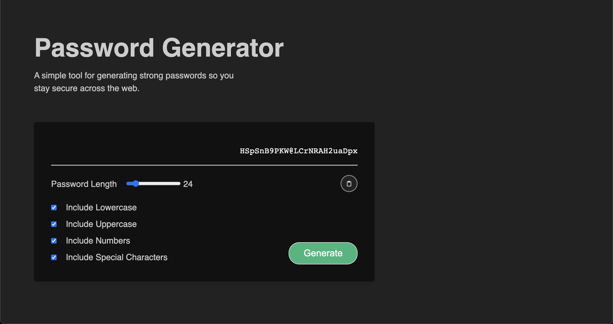

# Assignment Three : Password Generator

## My Process

I approached this assignment with the idea of building a contained password component that could be picked up and dropped into an application. I had a lot of fun exploring JavaScript to get the functionality that was required in the Acceptance Criteria. 

I was able to successfully research the functionality needed as well as come up with solutions on my own, which felt like an accomplishment in and of itself. I was also able to successfully work through a bug in which the password generation function was firing twice.

Note: I adapted the User Story a bit by having the user input the criteria of the password via a slider and a set of checkboxes PRIOR to generating the password. I did this as I believe it is an enhancment to the UX over a series of prompts as intially stated. This was an intentional deisgn decision which I belive is a value add to the component.

## Screengrab of Password Generator Component

